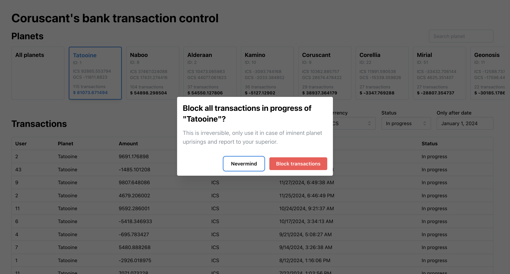

# Star Wars transaction control test

In a galaxy, far, far way, there was a developer doing his best to show his front-end skills.

Here you can check out a single page application, using `TypeScript`, `React`, `React Query` (for state management), `Mantine` (for the UI) and `Mirage JS` (for the API mock).

## Usage

After you have cloned this repo, install the dependencies with:

```
npm i
```

You can then start the application running:

```
npm start
```

Now, access [http://localhost:3000](http://localhost:3000) in your browser.

That's it, please enjoy!

### Testing

To run the tests and check the coverage, run the following command:

```
npm run test -- --coverage
```

## Features

1. **Transaction filtering:**

   Here we have the transactions listing, where we can filter transactions after a specified date, by status and by the executed currency.

   

2. **Planetary ranking:**

   The planets list, ranks each one by the number of transactions made, so the first ones are the ones with most transactions. And at the bottom of each card we can check the total amount on those transactions.

   

3. **Cumulative transaction values:**

   Real-time updates are included on the planets list, where we can also check the values for every currency listed.

   

4. **Security measures:**
   As we care for the order in the galaxy, we can also block every transaction of a planet, in case we detect any exploit of the financial system to finance the Empire.

   - Click the block button on the corner of the screen

     

   - Confirm the planet name on the dialog

     

   - Feel the joy of bringing peace across the galaxy

     
